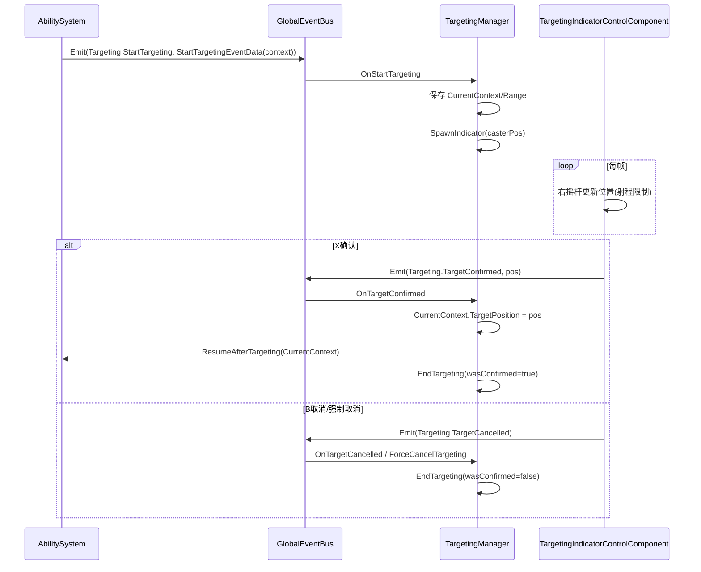

# TargetingManager 说明文档

## 概述

`TargetingManager` 是 Point / EntityOrPoint 技能的异步瞄准状态机。

它的职责是把“需要玩家选择位置”的技能流程，从 `AbilitySystem` 的同步流水线中拆出来：

- 接收 `StartTargeting` 全局事件并进入瞄准态
- 生成并销毁 `TargetingIndicatorEntity`
- 响应确认 (`TargetConfirmed`) 与取消 (`TargetCancelled`)
- 在确认时回调 `AbilitySystem.ResumeAfterTargeting(context)` 恢复施法流水线
- 在玩家死亡或外部强制打断时退出瞄准态

---

## 设计目标

1. **解耦**：`AbilitySystem` 只负责施法流水线，不处理右摇杆移动与确认输入。
2. **单一瞄准会话**：同一时刻只允许一个技能处于瞄准态。
3. **可恢复流水线**：确认时只填充 `CastContext.TargetPosition`，再回到统一流水线继续执行。
4. **可强制中断**：支持玩家死亡、控制效果等场景的外部取消。

---

## 核心状态

`TargetingManager` 维护以下运行时状态：

- `IsTargeting`：是否正在瞄准
- `CurrentCaster`：当前施法者
- `CurrentAbility`：当前技能
- `CurrentContext`：挂起的 `CastContext`
- `CurrentRange`：当前技能射程
- `_currentIndicator`：当前瞄准指示器实体

> `CurrentContext` 是“恢复流水线”的关键：确认时将目标点写回该上下文，再交还 `AbilitySystem`。

---

## 事件流

---

## 与技能系统协作边界

### AbilitySystem 负责

- 触发前检查（`CanUse`）
- 资源消耗（Charge/Cost）
- 冷却启动
- 效果执行
- 在 Point / EntityOrPoint 无预选位置时发起 `StartTargeting`

### TargetingManager 负责

- 异步瞄准状态管理
- 指示器实体创建与销毁
- 确认/取消事件处理
- 确认后调用 `ResumeAfterTargeting` 恢复统一流水线

---

## 输入与指示器

- 输入组件：`TargetingIndicatorControlComponent`
  - 右摇杆：移动指示器
  - `X`：确认
  - `B`：取消
- 指示器实体：`TargetingIndicatorEntity`
  - 仅作可视化容器，业务逻辑在控制组件中

---

## 生命周期与初始化

`TargetingManager` 使用 `[ModuleInitializer]` + `AutoLoad.Register` 自动注册，初始化时订阅：

- `Targeting.StartTargeting`
- `Targeting.TargetConfirmed`
- `Targeting.TargetCancelled`
- `Unit.Killed`（玩家死亡时强制取消）

---

## 扩展建议

1. **合法落点校验**：在确认前增加导航可达/地形阻挡检查。
2. **多模式指示器**：根据 `AbilityTargetGeometry` 切换圆形、扇形、直线预览。
3. **瞄准超时**：为瞄准会话增加超时自动取消。
4. **多人控制权**：将全局单例扩展为“按施法者实例隔离”的会话管理。

---

## 相关代码

- `Src/ECS/System/TargetingSystem/TargetingManager.cs`
- `Src/ECS/Component/Unit/TargetingIndicatorControlComponent/TargetingIndicatorControlComponent.cs`
- `Src/ECS/Entity/Unit/TargetingIndicator/TargetingIndicatorEntity.cs`
- `Data/EventType/Unit/Targeting/GameEventType_Targeting.cs`
- `Src/ECS/System/AbilitySystem/AbilitySystem.cs`
