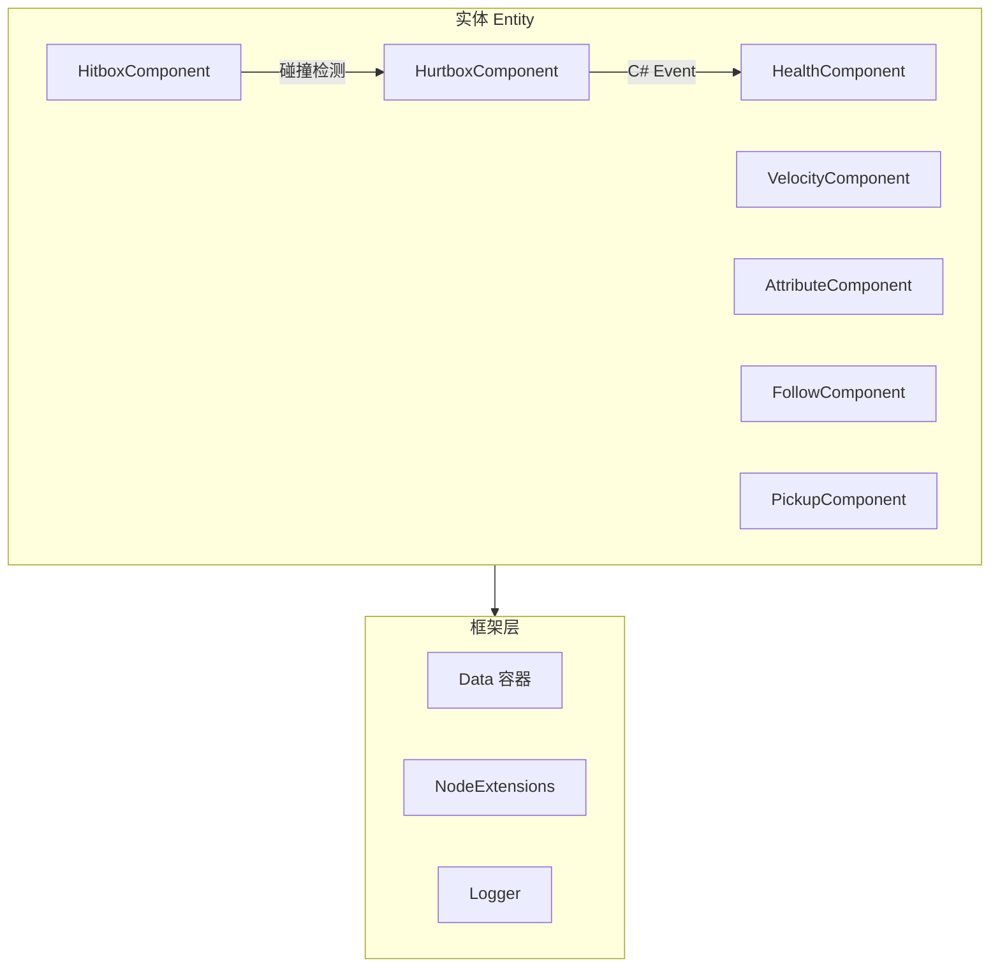
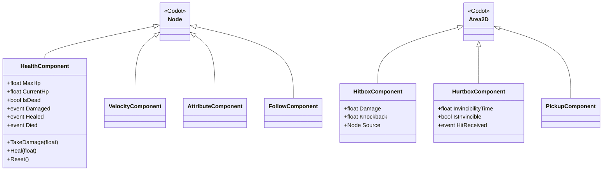

# 设计文档 - 组件系统 (Component System)

## 1. 概述

本设计文档描述 Brotato 复刻项目的"伪 ECS"组件系统架构。系统采用组合优于继承的设计理念，通过可复用的功能组件构建游戏实体。

核心设计目标：

- **高性能**：支持 500+ 同屏实体，使用 C# 原生事件替代 Godot 信号
- **可复用**：组件独立封装，可自由组合
- **类型安全**：利用 C# 强类型系统和泛型
- **内存安全**：通过 `_ExitTree` 生命周期管理事件订阅

## 2. 架构

### 2.1 整体架构



### 2.2 组件层次结构



## 3. 组件与接口

### 3.1 HealthComponent (生命值组件)

**职责**：管理实体的血量、伤害计算和死亡逻辑。

```csharp
public partial class HealthComponent : Node
{
    // 导出属性
    [Export] public float MaxHp { get; set; }

    // 运行时状态
    public float CurrentHp { get; private set; }
    public bool IsDead => CurrentHp <= 0;

    // C# 事件
    public event Action<float>? Damaged;
    public event Action<float>? Healed;
    public event Action? Died;

    // 公共方法
    public void TakeDamage(float damage);
    public void Heal(float amount);
    public void Reset();
}
```

### 3.2 HitboxComponent (攻击判定组件)

**职责**：定义攻击区域，携带伤害和击退信息。

```csharp
public partial class HitboxComponent : Area2D
{
    [Export] public float Damage { get; set; }
    [Export] public float Knockback { get; set; }
    public Node? Source { get; set; }
}
```

### 3.3 HurtboxComponent (受击判定组件)

**职责**：检测攻击并触发 HitReceived 事件。不直接依赖 HealthComponent，由实体负责协调伤害转发。

```csharp
public partial class HurtboxComponent : Area2D
{
    [Export] public float InvincibilityTime { get; set; }
    public bool IsInvincible { get; }
    public event Action<HitboxComponent>? HitReceived;
}

// 实体协调示例（在 Enemy.cs 或 Player.cs 中）
_hurtbox.HitReceived += (hitbox) => _health.TakeDamage(hitbox.Damage);
```

### 3.4 VelocityComponent (移动组件)

**职责**：处理实体的物理移动，包括加速、减速和限速。

```csharp
public partial class VelocityComponent : Node
{
    [Export] public float Speed { get; set; }
    [Export] public float Acceleration { get; set; }
    [Export] public float Friction { get; set; }

    public Vector2 Velocity { get; private set; }

    public void MoveToward(Vector2 direction, float delta);
    public void ApplyFriction(float delta);
    public Vector2 GetVelocity();
}
```

### 3.5 AttributeComponent (属性组件)

**职责**：管理基础属性和修改器系统。

```csharp
public enum ModifierType { Additive, Multiplicative }

public class StatModifier
{
    public string Id { get; }
    public string StatName { get; }
    public ModifierType Type { get; }
    public float Value { get; }
}

public partial class AttributeComponent : Node
{
    // 基础属性
    [Export] public float BaseDamage { get; set; }
    [Export] public float BaseSpeed { get; set; }
    [Export] public float BaseCritRate { get; set; }
    [Export] public float BaseCritMultiplier { get; set; }

    // 计算后的最终属性
    public float Damage { get; }
    public float Speed { get; }
    public float CritRate { get; }
    public float CritMultiplier { get; }

    // 修改器管理
    public void AddModifier(StatModifier modifier);
    public void RemoveModifier(string modifierId);
    public event Action? StatsChanged;
}
```

### 3.6 FollowComponent (跟随组件)

**职责**：实现 AI 实体的目标跟随逻辑。

```csharp
public partial class FollowComponent : Node
{
    [Export] public float FollowSpeed { get; set; }
    [Export] public float StopDistance { get; set; }

    public Node2D? Target { get; set; }

    public Vector2 GetDirectionToTarget();
    public bool IsInRange();
}
```

### 3.7 PickupComponent (拾取组件)

**职责**：实现掉落物的检测和磁吸效果。

```csharp
public partial class PickupComponent : Area2D
{
    [Export] public float MagnetSpeed { get; set; }
    [Export] public bool MagnetEnabled { get; set; }

    public Node2D? Collector { get; set; }
    public event Action<Node2D>? PickedUp;

    public void EnableMagnet(Node2D collector);
    public void DisableMagnet();
}
```

## 4. 数据模型

### 4.1 组件状态存储

所有运行时状态通过 `Data` 容器存储，支持动态属性和变更监听：

```csharp
// 使用示例
var data = node.GetData();
data.Set("currentHp", 100f);
data.On("currentHp", (oldVal, newVal) => { /* 响应变化 */ });
```

### 4.2 修改器数据结构

```csharp
public class StatModifier
{
    public string Id { get; init; }           // 唯一标识符
    public string StatName { get; init; }     // 目标属性名
    public ModifierType Type { get; init; }   // 加法/乘法
    public float Value { get; init; }         // 修改值
    public int Priority { get; init; }        // 计算优先级
}
```

### 4.3 属性计算公式

最终属性 = (基础值 + Σ 加法修改器) × Π 乘法修改器

```
FinalValue = (BaseValue + ΣAdditive) × ΠMultiplicative
```

## 5. 正确性属性

_A property is a characteristic or behavior that should hold true across all valid executions of a system-essentially, a formal statement about what the system should do.
Properties serve as the bridge between human-readable specifications and machine-verifiable correctness guarantees._

基于需求文档的验收标准，定义以下可测试的正确性属性：

### Property 1: Health Initialization

_For any_ positive MaxHp value, when a HealthComponent is initialized, CurrentHp SHALL equal MaxHp.
**Validates: Requirements 1.1**

### Property 2: Damage Reduces Health

_For any_ HealthComponent with CurrentHp > 0 and any positive damage value, calling TakeDamage SHALL reduce CurrentHp by exactly the damage amount (clamped to 0) and trigger the Damaged event with the actual damage dealt.
**Validates: Requirements 1.2**

### Property 3: Death Event Idempotence

_For any_ HealthComponent, the Died event SHALL be triggered exactly once when CurrentHp first reaches zero, regardless of how many subsequent TakeDamage calls are made.
**Validates: Requirements 1.3, 1.4**

### Property 4: Heal Respects Maximum

_For any_ HealthComponent with CurrentHp < MaxHp and any positive heal amount, calling Heal SHALL increase CurrentHp by at most (MaxHp - CurrentHp) and trigger the Healed event with the actual heal amount.
**Validates: Requirements 1.5, 1.6**

### Property 5: Hurtbox Damage Forwarding

_For any_ HurtboxComponent with an associated HealthComponent, when a HitboxComponent enters its area, the HealthComponent SHALL receive TakeDamage with the hitbox's Damage value.
**Validates: Requirements 3.2**

### Property 6: Hurtbox Event Without Health

_For any_ HurtboxComponent without an associated HealthComponent, when a HitboxComponent enters its area, the HitReceived event SHALL be triggered without errors.
**Validates: Requirements 3.3**

### Property 7: Invincibility Blocks Damage

_For any_ HurtboxComponent with InvincibilityTime > 0, after receiving a hit, subsequent hits within the invincibility period SHALL be ignored.
**Validates: Requirements 3.4**

### Property 8: Velocity Speed Limit Invariant

_For any_ VelocityComponent, regardless of MoveToward calls, the magnitude of Velocity SHALL never exceed Speed.
**Validates: Requirements 4.3**

### Property 9: Friction Reduces Speed

_For any_ VelocityComponent with non-zero Velocity, calling ApplyFriction SHALL reduce the Velocity magnitude (or set it to zero).
**Validates: Requirements 4.2**

### Property 10: Modifier Round Trip

_For any_ AttributeComponent and any StatModifier, adding then removing the same modifier SHALL restore the stat to its original value.
**Validates: Requirements 5.2**

### Property 11: Modifier Calculation Correctness

_For any_ AttributeComponent with base value B, additive modifiers [A1, A2, ...], and multiplicative modifiers [M1, M2, ...], the final value SHALL equal (B + ΣAi) × ΠMi.
**Validates: Requirements 5.3**

### Property 12: Direction Normalization

_For any_ FollowComponent with a valid Target at a different position, GetDirectionToTarget SHALL return a vector with magnitude 1.0 (±0.001 tolerance).
**Validates: Requirements 6.2**

### Property 13: Pickup Event Trigger

_For any_ PickupComponent, when a collector enters its area, the PickedUp event SHALL be triggered with the collector as parameter.
**Validates: Requirements 7.3**

### Property 14: Event Cleanup on Exit

_For any_ component with C# events, after \_ExitTree is called, all event delegates SHALL be null (no subscribers).
**Validates: Requirements 8.3**

## 6. 错误处理

### 6.1 无效输入处理

| 场景                      | 处理方式                               |
| ------------------------- | -------------------------------------- |
| TakeDamage(负值)          | 忽略，记录 Trace 日志                  |
| Heal(负值)                | 忽略，记录 Trace 日志                  |
| MaxHp 设为 0 或负数       | 强制设为 1，记录 Warn 日志             |
| 无 HealthComponent 时受击 | 触发 HitReceived 事件，不报错          |
| Target 为 null            | GetDirectionToTarget 返回 Vector2.Zero |

### 6.2 日志级别规范

- **Error**: 不应发生的异常情况
- **Warn**: 可恢复的配置错误
- **Info**: 重要状态变化（如死亡）
- **Debug**: 常规操作（如伤害、治疗）
- **Trace**: 详细调试信息（如忽略的操作）

## 7. 测试策略

### 7.1 单元测试 (Unit Testing)

使用简单的单元测试验证正确性属性，采用 Given-When-Then 模式。

**测试标注格式**：

```csharp
/// <summary>
/// **Feature: component-system, Property 1: Health Initialization**
/// **Validates: Requirements 1.1**
/// </summary>
```

### 7.2 测试覆盖范围

单元测试覆盖：

- 边界条件（零值、最大值）
- 组件集成点
- 特定示例验证
- 关键路径测试

### 7.3 测试文件组织

```
scenes/Test/ECS/
├── HealthComponentTests.cs      # HealthComponent 单元测试
├── HurtboxComponentTests.cs     # Hurtbox 单元测试
├── VelocityComponentTests.cs    # Velocity 单元测试
├── AttributeComponentTests.cs       # Stats 单元测试
├── FollowComponentTests.cs      # Follow 单元测试
├── PickupComponentTests.cs      # Pickup 单元测试
└── ComponentIntegrationTests.cs # 组件集成测试
```

### 7.4 测试用例示例

```csharp
// 边界测试：伤害 > 当前血量时，是否触发死亡？
var testCases = new[]
{
    (100f, 30f, 70f),    // 正常伤害
    (100f, 150f, 0f),    // 超量伤害
    (50f, 50f, 0f),      // 刚好致死
};

// 逻辑测试：无敌时间内，是否真的不扣血？
// 重置测试：Reset() 后，血量是否回满？
```
