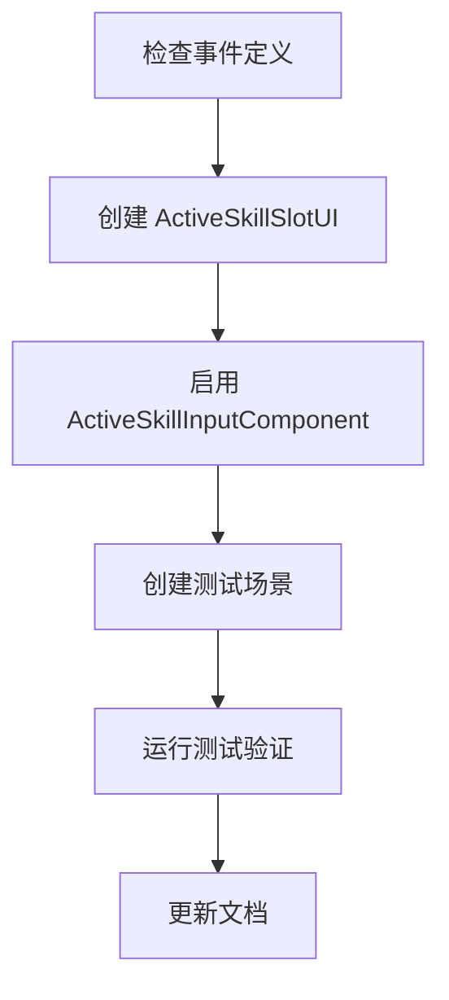

# 技能系统完善执行计划

**文档类型**：执行计划  
**目标受众**：开发人员、AI 助手  
**创建时间**：2026-01-28  
**预计工时**：4-6 小时

---

## 1. 项目概述

### 1.1 目标

完善技能系统的三个核心功能：
1. **技能 UI**：显示当前主动技能、冷却状态、充能层数
2. **ActiveSkillInputComponent**：启用手柄按键触发主动技能
3. **测试验证**：确保系统可正常运行

### 1.2 当前状态分析

| 模块 | 状态 | 说明 |
|:---|:---|:---|
| `AbilitySystem.cs` | ✅ 已完成 | 统一施法入口，就绪检查、消耗、冷却、执行流程完整 |
| `CooldownComponent` | ✅ 已完成 | 冷却计时、进度查询、事件驱动 |
| `ChargeComponent` | ✅ 已完成 | 充能消耗/恢复、进度查询 |
| `CostComponent` | ✅ 已完成 | 资源消耗检查与扣除 |
| `TriggerComponent` | ✅ 已完成 | 支持 Manual/OnEvent/Periodic/Permanent |
| `ActiveSkillInputComponent` | ⚠️ 待启用 | 框架已有，`_Process` 被注释，需启用并微调 |
| `SkillUI` | ❌ 未创建 | `Src/UI/UI/SkillUI/` 目录为空 |

---

## 2. 执行步骤

### Phase 1: 技能 UI 开发

#### 2.1.1 创建 ActiveSkillSlotUI

**目标**：显示当前选中的主动技能槽位

**文件路径**：
- `Src/UI/UI/SkillUI/ActiveSkillSlotUI.cs`
- `Src/UI/UI/SkillUI/ActiveSkillSlotUI.tscn`

**UI 结构**：
```
ActiveSkillSlotUI (Control)
├── Background (TextureRect)       # 槽位背景
├── IconContainer (Control)
│   ├── SkillIcon (TextureRect)    # 技能图标
│   └── CooldownOverlay (ColorRect) # 冷却遮罩（从上到下收缩）
├── ChargeLabel (Label)            # 充能数显示 "2/3"
├── KeyHint (Label)                # 按键提示 "X"
└── SkillNameLabel (Label)         # 技能名称（可选）
```

**核心逻辑**：
```csharp
public partial class ActiveSkillSlotUI : UIBase
{
    // 绑定到 PlayerEntity
    // 监听事件：
    // - GameEventType.UI.ActiveSkillSelected  → 切换技能图标
    // - GameEventType.Ability.ChargeRestored  → 更新充能显示
    // - GameEventType.Ability.Ready           → 冷却完成
    
    // _Process 中轮询冷却进度（因为需要平滑动画）
}
```

**依赖事件定义**（若缺失需补充）：
```csharp
// GameEventType.cs
public static class UI
{
    public static readonly string ActiveSkillSelected = "UI.ActiveSkillSelected";
    
    public record ActiveSkillSelectedEventData(
        int Index,
        string AbilityName
    );
}
```

#### 2.1.2 创建 SkillSlotContainer

**目标**：管理多个技能槽位的布局（可选，后续扩展用）

**说明**：当前采用单槽位+LB/RB切换方案，暂时只需一个 `ActiveSkillSlotUI`。

---

### Phase 2: 启用 ActiveSkillInputComponent

#### 2.2.1 取消注释 `_Process`

**文件**：`Src/ECS/Component/Player/ActiveSkillInputComponent/ActiveSkillInputComponent.cs`

**修改内容**：
```csharp
// 取消注释以下代码块
public override void _Process(double delta)
{
    if (_entity == null || _data == null) return;
    HandleActiveAbilityInput();
}
```

#### 2.2.2 优化输入逻辑

**当前按键映射**：
| 按键 | 功能 |
|:---|:---|
| LB | 切换到上一个主动技能 |
| RB | 切换到下一个主动技能 |
| X | 释放当前选中技能 |

**需确认**：
- [ ] `HandleActiveAbilityInput()` 逻辑正确性
- [ ] `GetActiveAbilities()` 筛选条件（`AbilityTriggerMode.Manual`）
- [ ] `BuildCastContext()` 目标解析逻辑

#### 2.2.3 添加组件到 PlayerEntity

**检查**：确保 `PlayerEntity._Ready()` 中已添加：
```csharp
EntityManager.AddComponent(this, new ActiveSkillInputComponent());
```

---

### Phase 3: 测试验证

#### 2.3.1 创建测试技能配置

使用现有的 `AbilityData.json` 中的技能：
- `Dash`：充能技能（3层，5秒恢复）
- `Slam`：消耗技能（20魔法，8秒CD）
- `ChainLightning`：消耗+CD技能（50魔法，6秒CD）

#### 2.3.2 测试用例

| 测试项 | 验证内容 | 预期结果 |
|:---|:---|:---|
| 技能切换 | 按 LB/RB | UI 显示切换，日志输出技能名 |
| 技能释放 | 按 X | 触发效果，CD/充能开始消耗 |
| 冷却显示 | 技能进入CD | UI 遮罩从上到下收缩 |
| 充能显示 | 消耗充能 | UI 显示 "1/3" 等 |
| 资源不足 | 无魔法时按X | 技能不触发，可选：播放错误音效 |

#### 2.3.3 测试场景

**路径**：`Src/Test/SingleTest/Ability/ActiveSkillInputTest.tscn`

**内容**：
- 创建 PlayerEntity
- 添加 3 个主动技能（Dash, Slam, ChainLightning）
- 挂载 ActiveSkillSlotUI
- 输出日志验证流程

---

### Phase 4: 文档更新

#### 2.4.1 更新现有文档

| 文档 | 更新内容 |
|:---|:---|
| `主动技能输入系统.md` | 添加 UI 章节、更新状态为"已完成" |
| `技能系统架构设计理念.md` | 添加 UI 层说明 |

#### 2.4.2 创建新文档

**路径**：`Docs/框架/ECS/Ability/技能UI系统.md`

**内容**：
- UI 结构说明
- 事件订阅说明
- 扩展指南（如何添加更多槽位）

---

## 3. 文件清单

### 3.1 需创建的文件

| 路径 | 类型 | 说明 |
|:---|:---|:---|
| `Src/UI/UI/SkillUI/ActiveSkillSlotUI.cs` | C# | 技能槽位 UI 逻辑 |
| `Src/UI/UI/SkillUI/ActiveSkillSlotUI.tscn` | Scene | 技能槽位 UI 场景 |
| `Src/Test/SingleTest/Ability/ActiveSkillInputTest.tscn` | Scene | 测试场景 |
| `Src/Test/SingleTest/Ability/ActiveSkillInputTest.cs` | C# | 测试脚本 |
| `Docs/框架/ECS/Ability/技能UI系统.md` | Markdown | UI 文档 |

### 3.2 需修改的文件

| 路径 | 修改内容 |
|:---|:---|
| `ActiveSkillInputComponent.cs` | 取消 `_Process` 注释 |
| `主动技能输入系统.md` | 更新状态、添加 UI 章节 |
| `GameEventType.cs` | 确认/添加 UI 事件定义（如缺失）|

---

## 4. 依赖检查

### 4.1 事件定义

需确认 `GameEventType.cs` 中存在：
- `GameEventType.UI.ActiveSkillSelected`
- `GameEventType.Ability.ChargeRestored`
- `GameEventType.Ability.Ready`

### 4.2 InputManager 映射

需确认 `project.godot` 中存在：
- `BtnLB` → 左肩键
- `BtnRB` → 右肩键
- `BtnX` → X键

### 4.3 PlayerEntity 组件

需确认 `PlayerEntity` 添加了：
- `ActiveSkillInputComponent`
- 至少一个 `AbilityEntity`（Manual 触发模式）

---

## 5. 风险与注意事项

| 风险 | 影响 | 缓解措施 |
|:---|:---|:---|
| 事件定义缺失 | 编译失败 | 先检查并补全事件定义 |
| PlayerEntity 未注册组件 | 输入无响应 | 检查 `_Ready` 初始化 |
| 技能未添加到玩家 | 无技能可切换 | 测试时手动添加技能 |
| UI 节点路径错误 | NullReferenceException | 使用 `%UniqueNodeName` 语法 |

---

## 6. 验收标准

1. ✅ 按 LB/RB 可循环切换主动技能，UI 图标同步更新
2. ✅ 按 X 可释放当前技能，冷却遮罩开始动画
3. ✅ 充能技能正确显示层数，消耗后数字减少
4. ✅ 冷却中/资源不足时释放被正确拦截
5. ✅ 所有相关文档已更新

---

## 7. 执行顺序



**推荐顺序**：
1. 先检查并补全事件定义（避免编译错误）
2. 创建 UI（可先用 Placeholder 图标）
3. 启用输入组件
4. 创建测试场景并调试
5. 最后更新文档

---

*文档结束*
