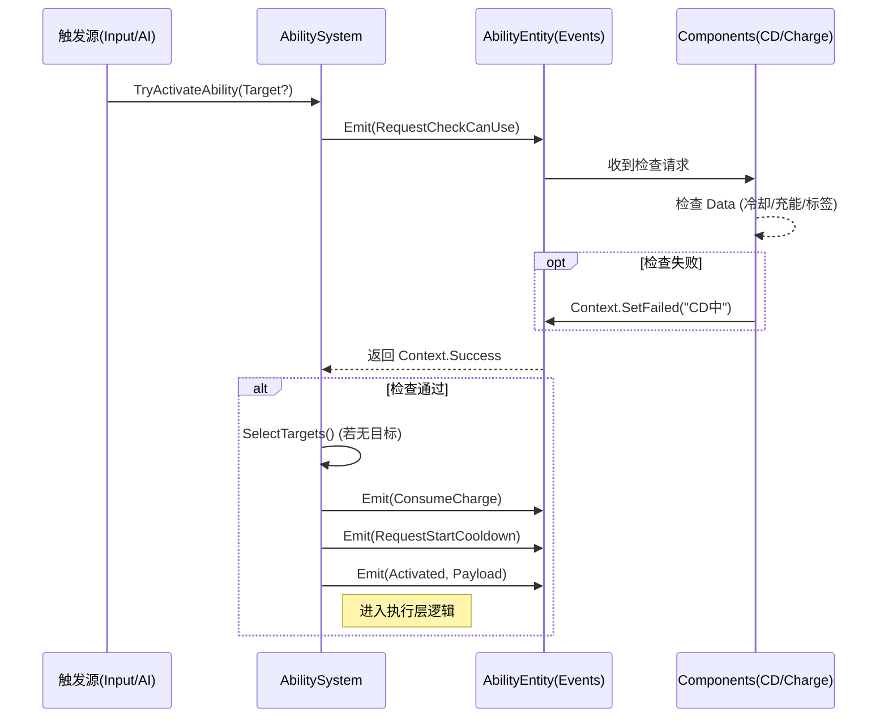

# 技能系统架构设计理念

**文档类型**：架构设计  
**目标受众**：架构师、核心开发人员、AI 助手  
**最后更新**：2026-01-20

---

## 1. 核心设计哲学

> [!IMPORTANT]
> **技能系统完全遵循项目 ECS 框架原则**，不引入任何外部框架的独立类概念。
> **核心思想**：Data 驱动状态，Event 驱动流程，System 驱动逻辑。

**架构一致性矩阵**：

| ECS 原则 | 技能系统实现 |
|:---|:---|
| **Scene 即 Entity** | `AbilityEntity` 继承 `Node` 实现 `IEntity`，归还对象池管理 |
| **Data 唯一数据源** | 所有技能属性（CD、伤害、范围）均通过 `DataKey` 存储，严禁组件私有状态 |
| **Component 无状态** | 组件仅负责响应事件和读写 `Data`，不持有运行时数据 |
| **EntityManager 入口** | 通过 `EntityManager.AddAbility` 创建，由关系管理器维护 Owner 关系 |
| **事件驱动通信** | 组件间解耦，通过 `Events.Emit()` 进行 "请求-响应"式交互 |

---

## 2. 核心架构：Trigger / Cast / Execute 分离

为了解决逻辑耦合，我们将技能流程严格拆分为三个阶段：

| 阶段 | 英文 | 职责 | 核心组件/系统 |
|:---|:---|:---|:---|
| **1. 触发层** | **Trigger** | 判断"什么时候该放"。只发出请求，不扣资源，不读条。 | `TriggerComponent` / `InputSystem` |
| **2. 施法层** | **Cast** | 判断"能不能放"。处理冷却、消耗、标签检查、目标选取。 | `AbilitySystem` (Static) |
| **3. 执行层** | **Execute** | 处理"怎么放"。生成子弹、造成伤害、应用Buff等具体业务。 | `AbilitySystem` -> `Executor` |

### 2.1 触发层 (Trigger)
*   **职责**：产生“施法请求” (`TryActivate`)。
*   **来源**：玩家输入、AI 决策、全局事件（如被击中触发）、周期性定时器。
*   **关键点**：触发层 **不应该** 直接修改冷却或消耗资源，它只是一个 "Intention" (意图)。

### 2.2 施法层 (Cast)
*   **职责**：验证意图，转化为行动。
*   **流程**：
    1.  **Check**: 发送 `RequestCheckCanUse`，询问所有组件（CD、消耗、标签）是否允许。
    2.  **Target**: 确定技能目标（手动指定 or 自动选取）。
    3.  **Cost**: 发送 `ConsumeCharge` / `RequestStartCooldown`。
    4.  **Activate**: 发出 `Activated` 事件，携带完整上下文（施法者、目标、事件源）。

### 2.3 执行层 (Execute)
*   **职责**：纯粹的业务逻辑执行。
*   **原则**：
    *   **独立性**：执行逻辑不写在 `AbilityData` (数据层)，也不写在 `EntityManager` (管理层)。
    *   **多态性**：每个技能可以有完全不同的执行逻辑 (脚本/策略模式)。
    *   **无状态**：执行器只依赖传入的 `Context` 进行操作。

---

## 3. 组件职责与通信

组件不直接相互调用，而是通过 `EventContext` 模式进行协作。

### 组件职责矩阵

| 组件 | 核心职责 | 监听事件 | 发送事件 |
|:---|:---|:---|:---|
| `TriggerComponent` | 触发源管理 (手动/自动/事件) | `GameEventType` (全局) | `TryActivate` |
| `CooldownComponent` | 冷却计时与检查 | `RequestCheckCanUse` `RequestStartCooldown` `RequestResetCooldown` | `Ready` |
| `ChargeComponent` | 充能次数管理 | `RequestCheckCanUse` `ConsumeCharge` `AddCharge` | `ChargesChanged` |

### 通信流程图 (Mermaid)

---

## 4. 数据结构设计 (DataKeys)

并不存在 `AbilityConfig` 类，所有配置均扁平化存储于 `Data` 中。

### 4.1 触发配置 (Trigger)
*   `AbilityTriggerMode` (Mask): Manual, OnEvent, Periodic, Auto
*   `AbilityTriggerEvent`: 监听的事件名 (如 `UnitKilled`)
*   `AbilityTriggerChance`: 触发几率

### 4.2 目标配置 (Targeting)
*   `AbilityTargetOrigin`: Self, Cursor, NearestEnemy...
*   `AbilityTargetGeometry`: Circle, Cone, Single...
*   `AbilityMaxTargets`: 最大目标数
*   `AbilityTargetTeamFilter`: 敌/友/中立

### 4.3 资源作为数据
*   `AbilityCooldown`: 基础冷却
*   `AbilityMaxCharges`: 最大充能
*   `AbilityChargeTime`: 充能回复时间 (<0 代表不自动回复)

---

## 5. 常见设计问答 (Q&A)

### Q1: 为什么执行逻辑不放在 EntityManager?
**A**: `EntityManager` 的职责是 **生命周期管理** (Spawn/Despawn/Pool)。执行逻辑属于 **业务行为**。将业务塞入管理器会导致上帝类 (God Class) 的诞生，违反单一职责原则。

### Q2: 为什么 TriggerComponent 不直接扣冷却?
**A**: 为了支持 "试图释放但失败" 的情况。例如：触发器想释放技能，但在此刻被沉默了，或者目标丢失了。如果触发器直接扣了冷却，就会导致逻辑错误。触发层只能表达 "我想放"，施法层（System）才决定 "能不能放"。

### Q3: 如何实现 "甚至不需要目标的被动技能"?
**A**: 将目标模式设为 `None` 或 `Self`。执行层逻辑会收到一个包含 `Self` 的目标列表，直接对自己应用效果即可。

---

## 6. 相关文档
- [Src/ECS/System/AbilitySystem/README.md](../../../../Src/ECS/System/AbilitySystem/README.md) - 具体使用指南
- [Src/ECS/Entity/Entity规范.md](../Entity/Entity规范.md)
- [DataKey 定义](../../../../Data/DataKeyRegister/Ability/DataKey_Ability.cs)
