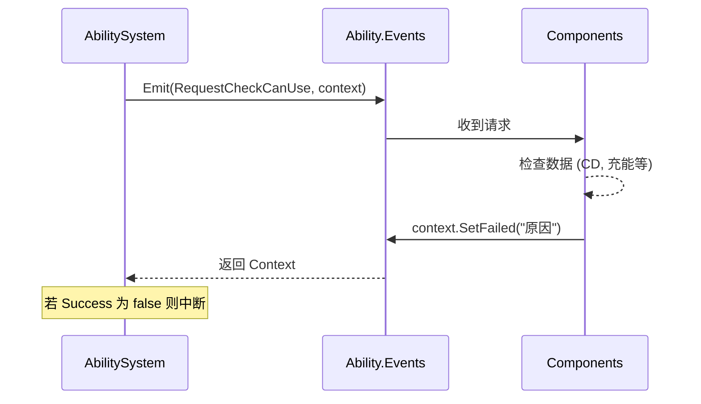

# 技能系统架构设计理念

**文档类型**：架构设计  
**目标受众**：架构师、新成员、AI 助手  
**最后更新**：2026-01-19

---

## 核心理念

> [!IMPORTANT]
> **技能系统完全遵循项目 ECS 框架原则**，不引入任何外部框架的独立类概念

**框架一致性**：

| ECS 原则 | 技能系统实现 |
|:---|:---|
| Scene 即 Entity | `AbilityEntity` 继承 `Node` 实现 `IEntity` |
| Data 唯一数据源 | 所有技能数据通过 `DataKey` 存储在 `Data` 中 |
| Component 无状态 | 组件只读写 `_data`（统一通过事件响应请求） |
| EntityManager 入口 | 通过 `EntityManager.AddAbility` 创建 |
| 事件驱动 | 核心流程完全依赖 `Events.Emit()` 通信 |

**设计借鉴**：

| 来源 | 借鉴理念 | 本地化实现 |
|:---|:---|:---|
| UE5 GAS | GameplayTags | 标签存储在 `Data` 中，由 `TagComponent` 处理 |
| Unity GAS | Context 模式 | 使用 `EventContext` 进行请求-响应式数据交换 |
| War3 | 事件+条件+动作 | 通过 `TriggerComponent` 监听事件 |

---

## 技能分类

| 特性 | 主动技能 | 被动技能 | 武器技能 |
|:---|:---|:---|:---|
| 触发 | 玩家输入 | 自动 | 自动攻击 |
| 充能 | ✅ | ❌ | ❌ |
| 冷却 | ✅ | ✅ 内部冷却 | ✅ 攻速 |
| 消耗 | ✅ | ❌ | ⚠️ 弹药 |

---

## 触发模式 - [Flags] 位运算

```csharp
[Flags]
public enum AbilityTriggerMode
{
    None = 0,
    Manual = 1 << 0,        // 手动
    OnEvent = 1 << 1,       // 事件
    Periodic = 1 << 2,      // 周期
    Permanent = 1 << 3,     // 永久
    Auto = 1 << 4,          // 自动
}
```

**使用**：
```csharp
var mode = (AbilityTriggerMode)_data.Get<int>(DataKey.AbilityTriggerMode);
if (mode.HasFlag(AbilityTriggerMode.OnEvent)) SubscribeToEvent();
```

---

## 目标系统 - 5 层 DataKey

> [!NOTE]
> **不使用独立类**，所有目标配置通过 `DataKey` 存储在 `Data` 中

### DataKey 定义

```csharp
// 目标系统
public const string AbilityTargetOrigin = "AbilityTargetOrigin";       // 选取原点
public const string AbilityTargetGeometry = "AbilityTargetGeometry";   // 几何形状
public const string AbilityTargetTeamFilter = "AbilityTargetTeamFilter"; // 阵营过滤
public const string AbilityTargetTypeFilter = "AbilityTargetTypeFilter"; // 类型过滤
public const string AbilityTargetSorting = "AbilityTargetSorting";     // 排序方式
public const string AbilityRange = "AbilityRange";                     // 范围
public const string AbilityMaxTargets = "AbilityMaxTargets";           // 最大目标数
```

### 枚举定义

```csharp
public enum AbilityTargetOrigin { Self, Unit, Point, EventSource, Cursor }
public enum AbilityTargetGeometry { Single, Circle, Box, Line, Cone, Chain, Global }
public enum AbilityTargetSorting { Nearest, Farthest, LowestHealth, Random }

[Flags]
public enum AbilityTargetTeamFilter { Friendly = 1, Enemy = 2, Neutral = 4, Self = 8 }

[Flags]
public enum AbilityTargetTypeFilter { Hero = 1, Creep = 2, Boss = 4, Ground = 8, Flying = 16 }
```

---

## 标签系统 - 通过 DataKey 实现

> [!WARNING]
> **不使用独立 `TagConfig` 类**，标签作为 `List<string>` 存储在 `Data` 中

### DataKey 定义

```csharp
// 标签系统
public const string AbilityAssetTags = "AbilityAssetTags";                       // 技能自身标签
public const string AbilityActivationRequiredTags = "AbilityActivationRequiredTags"; // 激活必须
public const string AbilityActivationBlockedTags = "AbilityActivationBlockedTags";   // 激活阻止
```

### TagComponent 实现

`TagComponent` 通过监听 `RequestCheckCanUse` 事件来参与激活检查：

```csharp
private void OnRequestCheckCanUse(GameEventType.Ability.RequestCheckCanUseEventData eventData)
{
    if (!CheckActivationTags(owner))
    {
        eventData.Context.SetFailed("标签冲突");
    }
}
```

---

## 组件职责矩阵

| 组件 | 职责 | 响应事件 |
|:---|:---|:---|
| TriggerComponent | 触发决策 | 发送 `TryActivate` |
| CooldownComponent | 冷却管理 | `RequestCheckCanUse`, `RequestStartCooldown` |
| ChargeComponent | 充能管理 | `RequestCheckCanUse`, `ConsumeCharge` |
| CostComponent | 消耗检查 | `RequestCheckCanUse` |
| TagComponent | 标签检查 | `RequestCheckCanUse` |

---

## 激活流程 - 事件驱动链

> [!NOTE]
> **业务逻辑中心化于 `AbilitySystem`**，而**状态检查去中心化于各 Component**

### 核心检查链



### 代码实现
```csharp
// AbilitySystem.cs
public static bool CanUseAbility(AbilityEntity ability)
{
    var context = new EventContext();
    ability.Events.Emit(
        GameEventType.Ability.RequestCheckCanUse,
        new GameEventType.Ability.RequestCheckCanUseEventData(ability, context)
    );
    return context.Success;
}
```

---

## 架构分层

```
AbilitySystem (静态逻辑)
    ↓ 协调
AbilityEntity (实体)
    ├─ Data: 唯一状态存数 (DataKey)
    ├─ Events: 实体级事件总线
    └─ Components: 响应 RequestCheck/RequestConsume
        ├─ CooldownComponent  → 处理计时
        ├─ ChargeComponent    → 处理次数
        └─ TriggerComponent   → 处理起始
    ↓ 产生关系
EntityRelationshipManager (关系管理)
    └─ ENTITY_TO_ABILITY 建立拥有者链接
```

---

## 配置示例 - 反伤光环

```csharp
{
    { DataKey.Name, "thorns_aura" },
    { DataKey.AbilityType, (int)AbilityType.Passive },
    
    // 触发模式
    { DataKey.AbilityTriggerMode, (int)AbilityTriggerMode.OnEvent },
    { DataKey.AbilityTriggerEvent, GameEventType.Unit.Damaged },
    { DataKey.AbilityTriggerChance, 0.5f },
    
    // 冷却（内部冷却）
    { DataKey.AbilityCooldown, 0.5f },
}
```

---

## 相关文档

- [Entity 架构设计理念](../Entity/Entity架构设计理念.md)
- [Data 容器系统](../../../../Src/ECS/Data/README.md)
- [Component 规范](../../../../Src/ECS/Component/Component规范.md)
- [Event Context 模式设计](../Event/Context模式设计.md)

---

**维护者**：项目团队  
**文档版本**：v3.0  
**重构确认**：2026-01-19
