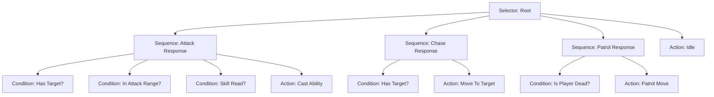

# AI系统设计文档 (ECS + 行为树 + 状态机)

## 1. 设计概述

本系统旨在构建一个通用、高性能且易于扩展的AI框架，专为Godot ECS架构设计。核心思想是将**决策逻辑（行为树）**与**执行逻辑（状态机/系统）**分离，所有AI运行时数据统一存储在**Entity.Data**中（遵循"Data 是唯一数据源"原则）。

### 核心目标
- **模块化**: 行为节点（Node）可复用。
- **ECS原生**: AI逻辑作为System运行，数据存储在Component中。
- **高性能**: 避免每帧频繁分配内存，使用对象池或预分配节点。
- **调试友好**: 行为树状态可视/可打印。

## 2. 架构设计

### 2.1 核心组件

#### AIComponent (Data)
存储AI的运行时状态和配置数据。
- **BehaviorTreeRunner**: 运行时行为树实例。
- **Entity.Data**: 统一数据容器，同时作为行为树节点间的共享数据载体（通过 DataKey 常量访问）。
- **Configuration**: 引用静态的行为树定义（Resource或代码构建）。

#### AISystem (Logic)
负责驱动AI的“大脑”。
- **Tick**: 每帧（或固定间隔）遍历所有拥有`AIComponent`的实体。
- **Execute**: 调用`AIComponent.BehaviorTreeRunner.Tick()`。

#### Behavior Tree (Decision)
分层决策结构，决定"做什么"（What/Why）。
- **Composite**: Selector（选择）, Sequence（序列）。
- **Decorator**: Inverter（反转）, Repeat（重复）, Cooldown（冷却）。
- **Condition**: 检查环境（如`IsTargetInRange`, `HasTarget`）。
- **Action**: 执行具体行为（如`MoveToTarget`, `Attack`）。

#### State Machine (Execution)
行为树的叶子节点（Action）通常触发状态机的状态转换，处理"怎么做"（How）。
- 例如：`AttackAction`节点并非直接每一帧写攻击代码，而是请求`AbilitySystem`释放技能，或者切换动画状态机到`Attack`状态。

### 2.2 ECS 集成流程

1.  **输入**: `TargetingSystem` / `SensorSystem` 更新黑板中的感知数据（`Target`, `Distance`）。
2.  **决策**: `AISystem` 运行行为树，遍历节点。
    - `Selector` 尝试：攻击? -> 追逐? -> 巡逻?
    - `Condition` 检查：有目标吗? 距离够吗?
    - `Action` 返回：`Running` (正在做), `Success` (做完了), `Failure` (做不了)。
3.  **输出**: `Action` 节点修改 `Entity` 的组件数据。
    - 设置 `velocity` (通过 `CharacterBody2D`)。
    - 请求 `AbilitySystem.TryTriggerAbility`。
    - 设置 `UnitAnimationComponent` 播放动画。

## 3. 详细设计

### 3.1 行为树节点 (BehaviorNode)

所有节点的基类，提供 `Evaluate(ProcessContext context)` 方法。

```csharp
public enum NodeState { Running, Success, Failure }

public abstract class BehaviorNode
{
    public abstract NodeState Evaluate(AIProcessContext context);
}
```

### 3.2 数据共享

AI 运行时数据统一存储在 `Entity.Data` 中（不再使用独立的 Blackboard）：
*   `DataKey.TargetNode`: 当前锁定的敌人（Node2D 引用）。
*   `DataKey.PatrolTargetPoint`: 下一个巡逻点。
*   `DataKey.PatrolWaitTimer`: 巡逻等待计时器。

### 3.3 示例行为逻辑：敌人AI

这是本案需求的具体实现逻辑。



### 3.4 关键Action实现细节

- **MoveToTarget**:
    - 计算到目标的方向向量。
    - 设置 `CharacterBody2D.Velocity`。
    - 面向目标（翻转 Sprite）。

- **Attack**:
    - 设置 `velocity = Vector2.Zero`（攻击时站立）。
    - 面向目标。
    - 调用 `AbilitySystem` 释放技能。
    - 返回 `Running` 直到技能结束（或动画结束）。

- **Patrol**:
    - 如果没有目标或玩家死亡。
    - 随机选择周围一点或按路径移动。

## 4. 文件结构规划

```
Src/
  AI/
    Core/
      BehaviorNode.cs
      CompositeNode.cs
      DecoratorNode.cs
      AIContext.cs
      BehaviorTreeRunner.cs
    Nodes/
      Actions/
        MoveToTargetNode.cs
        AttackNode.cs
        PatrolNode.cs
      Conditions/
        HasTargetNode.cs
        IsTargetInRangeNode.cs
  ECS/
    Component/
      AI/
        AIComponent.cs
    System/
      AI/
        AISystem.cs
```

## 5. 扩展性思考

- **可视化编辑器**: 未来可支持图形化编辑行为树，导出为JSON/Resource。
- **调试器**: 运行时在Entity上方显示当前活跃节点（Running Node）。
- **Utility AI**: 可以在Selector节点中引入Utility打分，而非固定优先级。

---
> **开发者注**: 本设计遵循现代游戏AI标准，结合Godot ECS特性，确保逻辑清晰、性能高效且易于为何。
```
