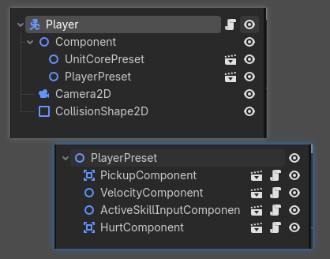

# 分享一个让我欲哭无泪的“幽灵碰撞”Debug血泪史（Godot踩坑记录）

发一个改Bug过程让大伙笑一下。
最近做 Godot C# ECS 框架遇到一个 Bug 搞了两天才搞好，跟 AI 对话十几二十轮才找到根本原因，最后还是 Gemini 3.1 发现的。

## 诡异的现象

本来想做一个 Player (`CharacterBody2D`) 碰到 Enemy (`CharacterBody2D`) 就扣血的机制：Player 身上有一个 `HurtComponent` (`Area2D`)，`CollisionLayer` 是 4，`CollisionMask` 是 3；Enemy 的 `CollisionLayer` 是 3。也就是说，由 `HurtComponent` 去扫描 Enemy。

但是测来测去发现诡异的现象：
- 要么 Player 没碰到 Enemy 就扣血（准确地说是每刷出一个 Enemy，Player 就虚空扣血，根本没碰到）；
- 要么 Player 碰到了 Enemy 却完全没扣血。

我一直怀疑是 Entity（Player、Component 都是 Entity）归还对象池时，**碰撞禁止失败**导致的残留，结果来来回回改了很多地方都没用——**根本不是禁止碰撞有问题，而是 `Node` 的问题！**

## 最根本原因：Node 阻断了坐标继承

这是一个非常经典的 Godot 4 引擎机制坑：

在我的 ECS 架构里，所有的组件都是由一个名为 `Component` 的普通 `Node` 作为父节点组织的（包括里面的 `UnitCorePreset`、`PlayerPreset` 等也都是 `Node`）。

但是在 Godot 4 中，一个 2D 空间节点（如 `HurtComponent` 这个 `Area2D`），**如果它的父节点是毫无空间属性的普通 `Node`，它将完全无法继承更上层级（如 `CharacterBody2D`）的空间变换（Transform）！**

**这意味着什么？**
这意味着所有敌人和玩家身上的 `HurtComponent`、`PickupComponent` 等所有物理感应区，自始至终都被 Godot 引擎死死地钉在了全局坐标 `(0, 0)` 的位置上！它们根本没有跟着你的玩家和敌人移动！

当敌人跑到你面前打你时，它的“肉体”过来了，但它的“受伤感应区”和“攻击打人区”全在十万八千里外的 `(0, 0)` 处挂机，你当然死活撞不出伤害，反而只要路过屏幕中心点就会被无数重叠的隐形判定框疯狂虚空狂揍！

## 期间踩过的坑（白忙活的极限操作）

> （前排提示：AI 一开始也没发现，最后我一步步指导 AI 打印各种距离信息分析，梳理每一次对话要解决什么问题、为什么修改无效后，AI 终于灵光一闪找出了 `Node` 这个元凶。）

在发现这个“坑爹”的核心原因之前，我曾以为是**对象池复用时的时序 Bug**，因此与 Godot 的物理引擎展开了漫长而痛苦的斗争。以下是我尝试过但最终都失败或被废弃的“退场方案”，每一个都暴露了 Godot 物理架构的底层陷阱：

### 1. 企图通过禁用逻辑来禁用物理：`ProcessMode = Disabled`

- **我的做法**：在对象入池休眠时，设置 `ProcessMode = Node.ProcessModeEnum.Disabled`。
- **为什么失败**：在 Godot 中（与 Unity 的 `SetActive(false)` 会立即移除物理体完全不同），`ProcessMode` **仅仅会停止逻辑层面的回调**（如 `_Process` / `_PhysicsProcess`）。**它根本不影响后端独立运行的 `PhysicsServer2D`！** 碰撞体依然留在场景的物理世界里，该触发碰撞还是照样触发。

### 2. 企图暴劫碰撞层：清空 `CollisionLayer` 和 `Monitoring`

- **我的做法**：不管三七二十一，入池时把碰撞掩码全设为 `0`，或者强制关掉 `Monitoring`。
- **为什么失败**：在我的 ECS 架构下，组件的注册（`OnComponentRegistered`）和激活（`EntitySpawned`）是多阶段的。每当实体出池重组组件时，代码都会按阵营设定重新覆盖 `CollisionLayer` 和 `Monitoring`。这导致了严重的**时序竞争**，防不胜防，旧的物理信号总是会漏过来。

### 3. 企图利用引擎原生延迟：`SetDeferred`

- **我的做法**：乖乖听官方文档的话，使用 `SetDeferred("monitoring", false)`。
- **为什么失败**：哪怕你用了 `SetDeferred`，Godot 每帧执行顺序也是极为严格的：
  1. `PhysicsServer.step()` （在此处完成了物理检测 broadphase）
  2. 此处碰撞信号其实已经排队
  3. `_Process` （逻辑回调）
  4. 信号分发 （引发 `body_entered` 触发伤害）
  5. `CallDeferred` （延迟执行修改操作）
  
  这意味当你使用 `SetDeferred` 修改物理状态时，**其实已经晚了**！Broadphase 早已被前面时序执行完毕，信号已经进入队列，木已成舟。

### 4. 企图手动拖延：`await PhysicsFrame` 二次确认

- **我的做法**：在触发 `body_entered` 时不立即造成伤害，而是 `await ToSignal(GetTree(), "physics_frame")`，等下一帧再去用 `GetOverlappingBodies()` 二次确认两者的距离。
- **为什么失败**：底层物理检测一旦发生，在下一帧物理信号分发前，状态往往未能完成完全的同步清理。`GetOverlappingBodies()` 即使推迟一帧获取，依然存在极大概率返回错误的历史对象，导致幽灵判定还是无法彻底屏蔽。

### 5. 企图空间隔离：流放至极远处（已废弃的“终极解”）

- **我的做法**：既然物理层怎么都防不住，那就在入池时直接把对象的 `GlobalPosition` 瞬间移动到十万八千里外（比如 `-99999`）。就算引擎非要延迟触发碰撞信号，也绝对碰不到地图中央的玩家！
- **为什么放弃**：这曾是我引以为傲的“终极解”，简单粗暴异常有效！但当我最终发现**其实是基础 `Node` 断了 Transform 导致碰撞框全堵在原点**的根本原因后，这套堪称精妙的“空间隔离”也成了无本之木。彻底修复节点层级类型（全改为 `Node2D`）后，只靠原生的 `Monitoring` 切换即可完美正常运作。